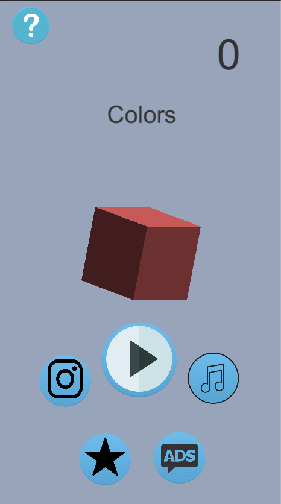
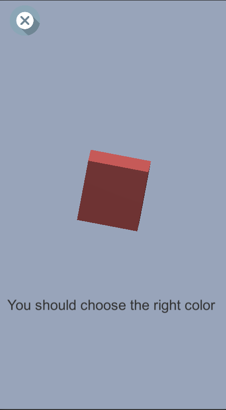

# Colors
> This game was created on Unity. This game is Colors. The idea was to create a game that will not only entertain, but also help people develop their skill to distinguish colors that are very similar to themselves. And the system of counting the record will motivate you to enter the game more often.

This is main menu

## Gameplay

The gameplay consists in choosing the correct color from 4 cubes. Three of them are the same, one is slightly different in color. With each correct answer, the difficulty increases as the colors become more and more similar to each other. It adds to the complexity that this needs to be done in literally a few seconds, if you do not have time, then the game is over and you need to start over

## End of the game

When you lose balance or the next cubes cannot be placed, this means that the game is over and the camera moves away along with the shaking to make the effect of a large object falling. The strength of the shaking increases with the height of the tower.

## The Shop
You can buy different colors of cubes in the store. The colors open automatically when you hit the required high score.

